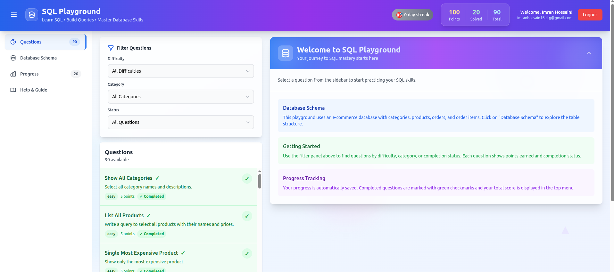

# Mohammad Imran Hossain — Personal Portfolio

Modern, performant portfolio built with React, Material UI, Tailwind CSS, and Vite. Includes a projects showcase, detailed case-study blog, interactive UI, dark/light theme, and an online resume optimized for recruiters.

    

## 🔗 Quick Links

- Live Site: https://imran-hossain-16.netlify.app/
- Projects: https://imran-hossain-16.netlify.app/projects
- Blog (case studies): https://imran-hossain-16.netlify.app/blog
- Resume (PDF): public/Mohammad_Imran_Hossain_Resume.pdf
- Resume (Markdown): resume.md
- LinkedIn: https://www.linkedin.com/in/mohammad-imran-hossain-783803135
- GitHub: https://github.com/imranctg16
- Email: mailto:imranhossain16.ctg@gmail.com

## 🎯 What To Review (Hiring Manager Guide)

- Enterprise Microservices Case Study: DWE Platform → projects page, then “Dynamic Workflow Engine (DWE)”. Repo: https://github.com/imranctg16/DWE-Microservice
- SQL Playground (Full‑stack app) → Live: https://imran-sql-playground.netlify.app/ • Code: https://github.com/imranctg16/sql-playground
- AWS Exam Prep (LMS) → Code: https://github.com/imranctg16/aws-exam-prep
- Deep Dive Blog: “MySQL ‘Server Has Gone Away’ — Root Cause & Fix” → https://imran-hossain-16.netlify.app/blog/1

## 🚀 Features

- Modern UI: Glassmorphism design, micro-interactions, smooth page transitions
- Theming: Dark/light mode with persistence
- Routing: Multi-page app (Home, Projects, Project Detail, Blog, Blog Post Detail, Resume)
- Blog: ReactMarkdown + syntax highlighting + case-study structure
- Performance: Vite build, code-splitting, lazy-loading, optimized assets
- Accessibility: Keyboard navigation, focus styles, contrast-aware theme
- Analytics (optional): GA4 with SPA pageview + event tracking

## 🛠️ Tech Stack

- Frontend: React 18, React Router 7
- UI: Material UI v7, Tailwind CSS
- Animation: Framer Motion
- Content: ReactMarkdown, remark-gfm, react-syntax-highlighter
- Utilities: react-intersection-observer, lucide-react, react-icons
- Tooling: Vite 5, ESLint, Prettier

## 📁 Project Structure

```
portfolio-project/
├── public/
│   ├── favicon.svg
│   ├── project-images/           # Public images for README/screenshots
│   └── Mohammad_Imran_Hossain_Resume.pdf
├── src/
│   ├── components/               # Header, Hero, Projects, Resume, Blog, etc.
│   ├── pages/                    # HomePage, ProjectsPage, ProjectDetailPage, Blog*, ResumePage
│   ├── data/                     # projects.js, blog.js
│   ├── utils/                    # analytics.js, motion.js
│   ├── contexts/                 # ThemeContext
│   ├── assets/                   # App assets (images, gifs)
│   ├── App.jsx
│   └── main.jsx
├── index.html
├── package.json
└── tailwind.config.js
```

## ⚡ Getting Started

Prerequisites:
- Node.js 18+ (Vite 5 requires Node >= 18)
- npm

Install & run:
```bash
git clone https://github.com/imranctg16/portfolio-project.git
cd portfolio-project
npm install
npm run dev
```

Open the URL printed in the terminal (typically http://localhost:5173).

Build & preview:
```bash
npm run build
npm run preview
```

## 🔧 Scripts

- `npm run dev`: Start dev server (HMR)
- `npm run build`: Production build to `dist/`
- `npm run preview`: Preview the production build
- `npm run lint`: Lint source files
- `npm run lint:fix`: Auto-fix lint issues
- `npm run format`: Prettier format

## ⚙️ Environment Variables

Optional GA4 analytics:
- Create `.env` and set `VITE_GA_ID=G-XXXXXXXXXX`
- See `.env.example` for reference

Analytics implementation tracks initial load and SPA route changes (see `src/utils/analytics.js`).

## 🧭 Customization

- Personal info & links: `src/components/Hero.jsx`, `src/components/Footer.jsx`, `src/pages/ResumePage.jsx`
- Projects data: `src/data/projects.js`
- Blog posts metadata: `src/data/blog.js` (content rendered via markdown fields)
- Styles/theme: Tailwind in `tailwind.config.js` + MUI theme via `ThemeContext`
- SEO: Update `index.html` meta, Open Graph, and Twitter tags

## 🖼️ Featured Project Screenshots




## 🌐 Deployment

Netlify / Vercel
- Build command: `npm run build`
- Publish/output directory: `dist`

Manual
- Run `npm run build` and serve the `dist/` directory on any static host

## 📄 License

MIT — see LICENSE.

## 🤝 Contact

- Email: imranhossain16.ctg@gmail.com
- LinkedIn: https://www.linkedin.com/in/mohammad-imran-hossain-783803135
- GitHub: https://github.com/imranctg16

---

If you find this useful, a star on GitHub is appreciated!
